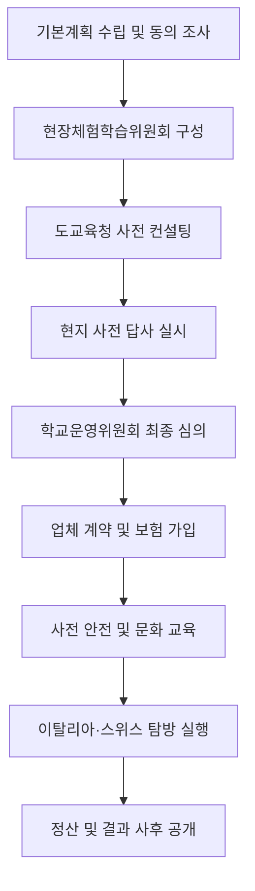
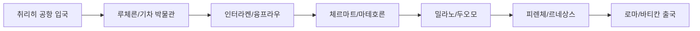

# 이탈리아·스위스 현장체험학습 및 가족 여행 운영 가이드

---

## Slide 1: 현장체험학습의 개요 및 목적
* **교육과정 연계 운영 원칙**: 학교 밖에서 이루어지는 체험 활동은 반드시 교육과정과 연계하여 학생들의 자율성과 창의성을 함양하고 개인의 꿈을 키우는 기회를 제공함,.
* **글로벌 인문학적 소양 강화**: 이탈리아의 고대·근대 서양사 현장과 스위스의 대자연을 직접 경험하며 인문학적 식견을 넓히고 세계 시민 의식을 기르는 데 중점을 둠.
* **체험 중심의 다채로운 활동**: 교실 내 지식 습득을 넘어 현지에서의 박물관 투어, 예술 감상, 자연 액티비티를 통해 지식의 외연을 확장하고 전인적 성장을 도모함,.
* **안전하고 체계적인 운영 지향**: 전라남도교육청의 매뉴얼을 준수하여 철저한 사전 준비와 안전 대책을 수립함으로써 사고 없는 유익한 교육 활동이 되도록 관리함,.
* **민주적 의사결정 과정 준수**: 학생 선호도 조사와 학부모 동의를 거쳐 방문국과 목적을 결정하고, 체험학습위원회의 심의를 통해 운영의 투명성과 공정성을 확보함,.

**상세 설명**
현장체험학습은 학교 교육과정의 연장선으로, 특히 국외에서 진행되는 이탈리아와 스위스 여행은 학생들에게 서양 문화의 근간을 배우고 대자연의 경이로움을 체험하게 하는 소중한 기회입니다. 전라남도교육청 매뉴얼에 따르면, 이러한 활동은 단순히 관광에 그치지 않고 교육적 목적이 명확해야 하며, 사전에 치밀한 계획 수립이 필수적입니다. 이탈리아의 로마, 피렌체 등에서 미켈란젤로와 라파엘로의 예술 세계를 접하고, 스위스의 융프라우 지역에서 알프스의 환경을 관찰하는 과정은 학생들의 창의적 사고를 자극합니다,. 모든 과정은 학생 안전을 최우선으로 하며, 학교 구성원 간의 민주적인 합의를 통해 장소와 프로그램을 선정하여 교육적 효과를 극대화해야 합니다,.

---

## Slide 2: 현장체험학습 유형 및 규모 기준
* **수학여행의 소규모 운영 원칙**: 학생 안전 관리와 내실 있는 학습을 위해 100명 미만의 소규모 테마형 운영을 기본으로 하되, 대규모 추진 시 엄격한 조건을 충족해야 함.
* **국외 체험학습의 조건부 허용**: 국외 수학여행은 학부모 동의율 90% 이상 확보와 도교육청의 사전 컨설팅 실시를 모두 충족해야만 추진이 가능한 특수 유형임,.
* **안전요원 배치 의무 준수**: 국외 활동의 경우 운영 규모와 관계없이 학생 50명당 1명 이상의 안전요원을 반드시 배치하여 현지에서의 돌발 사고에 신속히 대응함.
* **1일형 및 숙박형 활동 구분**: 체험 목적에 따라 숙박을 동반하는 수학여행과 수련활동, 또는 숙박 없이 진행되는 1일형 현장체험학습으로 분류하여 매뉴얼을 적용함.
* **규모별 컨설팅 실시 의무**: 대규모(150명 이상) 및 국외 수학여행은 계획의 적정성 확인을 위해 교육청의 컨설팅을 의무적으로 받아야 하며 결과를 계획에 반영함.

**표 1. 수학여행 규모별 운영 및 승인 기준**

| 구분 | 소규모 | 중규모 | 대규모 | 국외 |
| :--- | :--- | :--- | :--- | :--- |
| 학생 수 | 100명 미만 | 100~149명 | 150명 이상 | 제한 없음 |
| 학부모 동의 | 학교 자율 | 80% 이상 | 90% 이상 | 90% 이상 |
| 컨설팅 | 권장 | 권장 | 의무 | 의무 |
| 안전요원 | 50명당 1명 | 50명당 1명 | 50명당 1명 | 50명당 1명 |

**상세 설명**
국외 현장체험학습은 국내 활동보다 훨씬 엄격한 기준이 적용됩니다. 이탈리아와 스위스 같은 장거리 여행은 학생 1인당 경비가 높고 안전 관리 요소가 많기 때문에 학부모의 90% 이상이 찬성해야 하며, 교육청 전문가들로 구성된 지원단의 컨설팅을 통해 계획의 빈틈을 메워야 합니다,. 특히 안전요원은 단순 인솔 보조를 넘어 응급처치 및 구조 자격을 갖춘 인력이어야 하며, 국외 여행 중 발생할 수 있는 식중독, 감염병, 교통사고 등에 대비한 체계적인 대응 매뉴얼을 갖추는 것이 필수입니다,. 이러한 기준은 학생들의 생명과 안전을 보호하고, 부실한 프로그램 운영으로 인한 교육적 손실을 방지하기 위한 최소한의 장치입니다.

---

## Slide 3: 국외 체험학습 추진 절차 시각화
* **기본계획 및 위원회 구성**: 가정통신문을 통해 학생 선호도와 학부모 동의를 조사하고, 교직원과 학부모가 참여하는 체험학습위원회를 구성하여 방문국과 일정을 결정함.
* **사전 답사 및 안전 점검**: 실제 인솔 담당자가 현지를 방문하여 숙박 시설의 소방 안전, 식당의 위생 상태, 체험 장소의 동선 등을 직접 확인하고 보고서를 작성함,.
* **학교운영위원회 심의 및 계약**: 사전 답사 결과와 수익자 부담 경비 등을 종합하여 심의를 받은 후, 조달 시스템(G2B) 등을 통해 투명하게 업체 계약을 진행함,.
* **사전 교육 및 실행 단계**: 학생과 인솔자를 대상으로 안전 수칙, 성범죄 예방, 현지 문화 교육을 실시하고, 계획된 일정에 따라 안전하게 탐방 프로그램을 운영함,.
* **사후 관리 및 정산 공개**: 활동 종료 후 10일 이내에 경비를 정산하고, 만족도 설문 조사 결과를 분석하여 도교육청 홈페이지에 공개함으로써 운영의 투명성을 높임,.

**시각화: 국외체험학습 추진 흐름도**

**상세 설명**
국외 체험학습은 준비부터 마무리까지 단계별 절차를 누락 없이 이행하는 것이 중요합니다. 초기 단계에서는 학생들의 요구를 반영한 코스 선정이 이루어져야 하며, 이탈리아의 유적지나 스위스의 박물관 등 교육적 가치가 높은 장소를 포함해야 합니다,. 특히 사전 답사는 여행사에 위임할 수 없으며 인솔 책임자가 직접 가서 안전 요소를 점검해야 합니다. 계약 단계에서는 공정거래위원회의 표준약관을 적용하여 학생들의 권익을 보호하고, 여행자 보험 가입 시 상해와 의료비 보장 범위를 충분히 확보해야 합니다,. 모든 과정은 전자결재를 통해 기록으로 남겨야 하며, 결과 공개를 통해 학교 행정의 신뢰도를 구축해야 합니다.

---

## Slide 4: 유럽 여행 필수 준비물 및 짐 싸기 팁
* **캐리어 및 가방 선정 전략**: 유럽의 소매치기를 대비하여 지퍼를 쉽게 찢을 수 없는 프레임형 금고식 캐리어를 선택하고, 공항에서 유용한 가벼운 크로스백을 준비함,.
* **소매치기 방지 안전 아이템**: 카라비너 스프링 스트랩으로 지갑과 가방을 연결하고, 핸드폰에는 어깨 스트랩이나 손목 스프링을 장착하여 도난 사고를 원천 차단함,.
* **피부 및 위생 보호 용품**: 유럽의 석회수로부터 피부를 지키기 위해 여행용 샤워기 필터와 리필 필터를 지참하며, 호텔 침구 위생을 위한 베드버그 퇴치 스프레이를 챙김,.
* **전기 및 통신 기기 준비**: 다양한 국가에서 사용 가능한 멀티 어댑터와 C타입 포트가 넉넉한 충전기를 준비하고, 방문국(이탈리아, 스위스)이 모두 포함된 다국가 유심을 구매함,.
* **비상 서류 및 데이터 보관**: 여권 분실 시를 대비하여 여권 사본과 비자 서류, 숙소 바우처 등을 출력하여 별도 보관하고 핸드폰에도 사진으로 저장해 둠.

**표 2. 유럽 여행 준비물 체크리스트**

| 카테고리 | 필수 아이템 | 용도 및 비고 |
| :--- | :--- | :--- |
| 안전 | 스프링 스트랩, 와이어 자물쇠 | 소매치기 예방, 기차 내 짐 묶기 |
| 위생 | 샤워 필터, 베드버그 스프레이 | 석회수 방지, 숙소 해충 예방 |
| 전자 | 멀티 어댑터, 보조 배터리 | 전압 변환, 장시간 이동 대비 |
| 서류 | 여권 사본, 여행자 보험증권 | 분실 및 사고 대비 증빙 |
| 통신 | 다국가 유심 (42개국 지원 등) | 이탈리아-스위스 로밍 해결 |

**상세 설명**
유럽 여행, 특히 이탈리아와 스위스를 장기간 여행할 때는 꼼꼼한 짐 싸기가 여행의 질을 결정합니다. 소매치기가 빈번한 지역이 포함되므로 카라비너나 와이어 자물쇠를 활용해 소지품을 가방에 고정하는 지혜가 필요합니다. 또한 스위스의 높은 고도와 이탈리아의 강한 햇살에 대비해 선크림과 선글라스는 필수이며, 장거리 비행의 건조함을 해소할 가습 마스크도 유용합니다,. 특히 유심 구매 시 스위스가 유럽 연합(EU) 소속이 아니어서 일부 저가 유심에서는 지원되지 않을 수 있으므로 반드시 방문 국가 포함 여부를 확인해야 합니다. 짐의 무게를 수시로 체크할 수 있는 휴대용 손 저울도 수화물 초과 요금을 방지하는 데 큰 도움이 됩니다.

---

## Slide 5: 통화 환전 및 결제 시스템 활용
* **이중 통화 체계 이해**: 이탈리아는 유로(EUR)를, 스위스는 스위스 프랑(CHF)을 사용하므로 각각의 통화를 적절한 비율로 환전하여 준비해야 함.
* **유로 통화의 유용성 활용**: 스위스 내 많은 관광지와 상점에서도 유로 결제가 가능하므로, 이탈리아와 공통으로 사용 가능한 유로를 조금 더 넉넉히 환전하는 것이 전략적임.
* **트래블 체크카드 메인 사용**: 실시간 환전과 수수료 면제 혜택이 있는 트래블 월렛이나 신한 솔(SOL) 트래블 카드 등을 메인 결제 수단으로 활용하여 현금을 최소화함,.
* **비상용 현금 확보**: 카드 결제가 불가능한 소규모 상점이나 유료 화장실 이용을 위해 소액의 현지 통화(특히 1.5~2프랑 동전)를 항상 소지함.
* **실시간 환율 우대 적용**: 은행 앱을 통해 100% 환율 우대를 받으며 필요한 금액만큼 즉시 충전하여 현지 ATM에서 인출하는 방식을 통해 도난 위험과 비용을 동시에 줄임.

**표 3. 방문국별 통화 및 결제 정보**

| 국가 | 사용 통화 | 주요 결제 수단 | 현지 팁 |
| :--- | :--- | :--- | :--- |
| 이탈리아 | 유로 (EUR) | 트래블 카드, 유로 현금 | 소매치기 주의, 카드 선호 |
| 스위스 | 스위스 프랑 (CHF) | 트래블 카드, 프랑 현금 | 유로 통용 가능(거스름돈은 프랑) |
| 공통 | 트래블 월렛/솔 | ATM 인출 및 직결제 | 수수료 절감 및 실시간 환전 |

**상세 설명**
과거에는 현금을 많이 들고 다니는 것이 일반적이었으나, 최근에는 보안과 편리성을 위해 트래블 카드를 사용하는 것이 대세입니다. 신한 솔 트래블 카드와 같은 상품은 전 세계 30종 통화에 대해 환율 우대를 제공하며, 현지 ATM 인출 수수료도 면제해 줍니다. 스위스 여행 시 주의할 점은 마트나 식당 물가가 매우 높다는 것인데, 잔돈이 남지 않도록 동전을 먼저 내고 부족한 금액만 카드로 결제하는 방식을 추천합니다. 또한 이탈리아 기차역 등에서 현금 인출 시에는 주변을 잘 살피고 소매치기를 경계해야 하며, 가급적 은행 내부에 설치된 ATM을 이용하는 것이 안전합니다.

---

## Slide 6: 스위스 교통 패스 비교 및 선택
* **스위스 트래블 패스 혜택**: 기차, 버스, 유람선을 무제한 이용할 수 있으며 500여 곳의 박물관 무료 입장과 케이블카 할인 혜택이 포함되어 스위스 일주에 최적임.
* **유레일 패스와의 차별점**: 유럽 여러 나라를 연계할 때는 유레일 패스가 유리할 수 있으나, 스위스 내 버스나 유람선 혜택은 스위스 트래블 패스가 훨씬 강력함,.
* **융프라우 VIP 패스 활용**: 융프라우 지역을 집중 탐방한다면 한국인 전용 융프라우 VIP 패스를 통해 산악 열차 할인과 컵라면 무료 제공 등의 특화된 혜택을 누림,.
* **SBB 앱을 통한 실시간 관리**: 스위스 철도청(SBB) 앱을 설치하여 정확한 열차 시간, 플랫폼 정보, 패스 등록 상태를 실시간으로 확인하며 유동적으로 이동함,.
* **어린이 동반 할인 제도**: 부모가 패스를 소지한 경우 만 15세 미만 어린이는 '패밀리 카드'를 통해 무료로 동반 탑승이 가능하여 가족 여행 경비를 크게 절감함,.

**표 4. 스위스 교통 패스 비교 요약**

| 항목 | 스위스 트래블 패스 | 유레일 스위스 패스 | 융프라우 VIP 패스 |
| :--- | :--- | :--- | :--- |
| 주요 범위 | 스위스 전역 무제한 | 기차 중심 (버스/트램 제한) | 융프라우 지역 특화 |
| 추가 혜택 | 박물관 500곳 무료, 유람선 | 기차 요금 할인 중심 | 산악 열차, 컵라면 등 |
| 추천 대상 | 4일 이상 스위스 집중 여행 | 유럽 여러 국가 연계 여행 | 융프라우 지역 집중 방문객 |

**상세 설명**
스위스는 대중교통 비용이 매우 비싸기 때문에 일정에 맞는 패스 선택이 필수적입니다. 5일간의 이동 요금이 개별 티켓으로 구매 시 55만 원이라면, 4일권 패스는 약 42만 원으로 20% 이상 저렴해집니다. 특히 유람선이나 리기산 산악 열차 등을 무료로 탈 수 있어 단순 이동을 넘어 관광 패스로서의 가치도 큽니다. 주의할 점은 베르니나 익스프레스와 같은 특별 관광 열차는 패스가 있더라도 별도의 좌석 예약비가 발생할 수 있다는 점입니다. 여행 전 SBB 앱을 활용해 이동 경로를 미리 검색해보고, 예상 비용이 200프랑을 넘는다면 패스를 구매하는 것이 경제적으로 안전합니다.

---

## Slide 7: 숙소 선정 전략 및 지역별 특징
* **이동 편의를 위한 역세권 숙소**: 짐이 많은 여행의 특성상 인터라켄 동역(Ost)이나 슈피츠 역 등 기차역에서 도보 5~10분 이내의 숙소를 잡는 것이 체력 소모를 줄이는 핵심임,.
* **취사 시설을 갖춘 아파트 선호**: 스위스의 높은 외식 물가를 고려하여 주방이 딸린 에어비앤비나 아파트먼트형 숙소를 예약해 직접 요리해 먹음으로써 경비를 절감함,.
* **전망과 액티비티 중심지 선택**: 피르스트 액티비티나 별 구경을 원한다면 그린델발트에서 2박 이상 머무는 것을 추천하며, 인터라켄은 주변 도시 당일치기 거점으로 활용함,.
* **스위스 스타일 샬렛의 특징**: 나무로 지어진 전통 샬렛은 낭만적이지만 층간 소음이나 방음 문제가 있을 수 있으므로 현대식 아파트와 비교하여 선택함.
* **지자체 안심 서비스 확인**: 현장체험학습 시에는 지자체에서 제공하는 안심 서비스를 통해 숙소의 소방, 위생, 전기 안전 점검 결과를 미리 확인하여 학생들의 안전을 보장함.

**표 5. 스위스 주요 숙박 거점 비교**

| 지역 | 특징 | 장점 | 단점 |
| :--- | :--- | :--- | :--- |
| 인터라켄 동역 | 교통의 허브 | 모든 지역 이동이 매우 편리함 | 소음 발생 가능, 관광객 밀집 |
| 그린델발트 | 알프스 산맥 뷰 | 액티비티 접근성 최고, 풍경 우수 | 인터라켄보다 숙박비 높음 |
| 슈피츠 | 조용한 호수 마을 | 인터라켄보다 덜 붐비고 경치 좋음 | 숙소 옵션이 상대적으로 적음 |

**상세 설명**
스위스 숙소는 단순히 잠만 자는 곳이 아니라 여행의 거점이 됩니다. 인터라켄은 루체른, 체르마트, 베른 등 여러 도시를 당일치기로 여행하기에 가장 좋은 중심지입니다. 만약 예산이 넉넉하고 알프스의 아침을 만끽하고 싶다면 그린델발트가 최고의 선택이지만, 짐을 들고 언덕을 오르내려야 할 수도 있음을 고려해야 합니다,. 또한 스위스 식당에서 한 끼 식사에 인당 10만 원 가까이 지출되는 경우가 흔하므로, 마트(Coop, Migros)에서 장을 봐서 숙소에서 해결하는 것이 '텅장'을 방지하는 지름길입니다.

---

## Slide 8: 음식 및 물 관리 전략
* **트래블 전기 포트 활용**: 부피를 줄일 수 있는 실리콘 접이식 전기 포트를 지참하여 숙소에서 햇반, 컵라면, 국물 요리 등을 직접 조리해 먹으며 위생과 비용을 챙김,.
* **저가형 마트(알디, 리들) 이용**: 스위스 국민 마트인 쿱(Coop)보다 독일계 마트인 알디(ALDI)나 리들(LIDL)이 식료품 가격이 훨씬 저렴하므로 이를 적극 활용함.
* **수돗물 식수 활용 및 생수 준비**: 스위스 수돗물은 마실 수 있는 물이므로 텀블러를 준비해 비용을 아끼되, 석회수가 걱정된다면 브리타 필터나 생수를 마트에서 미리 구입함.
* **실온 보관 식품 비축**: 장기 여행에 적합한 볶음 김치, 고추참치, 김, 포카리스웨트 분말 등 실온에서 상하지 않는 반찬 위주로 준비하여 식사의 질을 높임.
* **현지 식당 이용 시 에티켓**: 식당이나 기차 매표소에서 먼저 "헬로"나 "당케"라고 인사를 건네면 직원들이 훨씬 친절하게 응대하며 여행의 즐거움이 배가됨.

**표 6. 유럽 여행 식사 해결 방법 비교**

| 방법 | 장점 | 단점 | 팁 |
| :--- | :--- | :--- | :--- |
| 현지 레스토랑 | 현지 미식 체험, 낭만적 | 매우 비싼 가격 (한 끼 10~20만) | 런치 메뉴나 '오늘의 요리' 활용 |
| 마트 장보기 | 저렴한 비용, 다양한 식재료 | 요리 시간 소요, 뒷정리 | 알디, 리들이 쿱보다 저렴함 |
| 한국 식품 조리 | 입맛 유지, 가장 경제적 | 짐 부피 증가 | 실리콘 전기 포트 필수 지참 |

**상세 설명**
스위스의 물가는 전 세계적으로 악명이 높으며, 식당에서 피자 한 판과 맥주 한 잔만 마셔도 10만 원이 우습게 나갑니다. 따라서 주방이 있는 숙소를 예약하고 마트에서 고기와 야채를 사서 직접 요리해 먹는 과정 자체가 스위스 여행의 큰 재미이자 경제적인 전략입니다. 특히 관광지 매점에서는 생수 한 병이 마트의 몇 배 가격으로 뛰기 때문에 숙소 근처 마트에서 묶음으로 미리 사두는 것이 좋습니다. 또한 이탈리아와 스위스의 물은 석회질이 많으므로 예민한 학생이나 여행자는 세안 마지막 단계에서 생수를 사용하거나 샤워기 필터를 장착하는 것이 피부 트러블을 방지하는 방법입니다.

---

## Slide 9: 스위스 융프라우 지역 탐방 가이드
* **융프라우요흐의 상징성**: '하늘과 가장 가까운 유럽'이라는 별칭답게 고산 열차를 타고 올라가 만년설을 감상하며 스노우펀 액티비티(눈썰매, 짚라인)를 즐길 수 있음.
* **기상 상황에 따른 유동적 일정**: 융프라우 지역은 날씨 변화가 심하므로 매일 아침 웹캠으로 정상 날씨를 확인한 후 맑은 날을 골라 올라가는 것이 필수적임.
* **어린이를 위한 멘리헨 놀이터**: 고도가 낮아 고산병 위험이 적은 멘리헨에는 자연 친화적인 나무 놀이터와 소 모양 전망대가 있어 아이와 함께 방문하기에 최적임.
* **특별한 추억, 엽서 보내기**: 융프라우요흐 정상의 우체통에서 직접 엽서를 써서 보내는 체험은 여행의 감동을 한국으로 이어주는 생소하고 즐거운 경험이 됨.
* **동신항운 할인 쿠폰 지참**: 융프라우 VIP 패스 구매 시 필수적인 동신항운 쿠폰을 인원수대로 출력해 가면 큰 폭의 할인과 정상에서의 컵라면 혜택을 받을 수 있음.

**표 7. 융프라우 지역 주요 명소 특징**

| 명소 | 해발 고도 | 주요 활동 | 특징 |
| :--- | :--- | :--- | :--- |
| 융프라우요흐 | 3,454m | 만년설 감상, 눈썰매, 엽서 쓰기 | 랜드마크, 고산병 주의 필요 |
| 멘리헨 | 2,230m | 로열 워크 하이킹, 나무 놀이터 | 아이와 가기 좋음, 완만한 코스 |
| 피르스트 | 2,168m | 클리프 워크, 글라이더, 트로티바이크 | 액티비티의 천국 |
| 뮤렌 | 1,638m | 통나무 포토존, 산책 | 자동차 없는 청정 마을 |

**상세 설명**
융프라우 지역은 대자연과 소박한 마을의 풍경을 동시에 만끽할 수 있는 알프스 최고의 여행지입니다. 융프라우요흐로 향하는 길은 그 자체로 거대한 공학적 걸작이며, 정상에서의 눈썰매 체험은 아이들에게 잊지 못할 추억을 선사합니다. 고산병이 우려된다면 멘리헨의 'Royal Walk' 하이킹을 통해 완만하게 고도에 적응하는 것도 좋은 방법입니다. 무엇보다 스위스 트래블 패스만으로는 융프라우 열차 이용에 한계가 있으므로, 동신항운 쿠폰을 활용한 VIP 패스 구매가 가장 합리적입니다. 날씨가 좋지 않은 날에는 억지로 산에 오르기보다 아래 마을인 인터라켄이나 주변 호수를 탐방하는 유연함이 필요합니다.

---

## Slide 10: 스위스 주요 박물관 및 체험 코스
* **루체른 교통 박물관**: 스위스에서 가장 방문객이 많은 곳으로 도로, 철도, 해상, 항공 교통의 과거와 미래를 다양한 인터랙티브 전시를 통해 체험할 수 있음,.
* **취리히 린트 초콜릿 박물관**: 9m 높이의 거대한 초콜릿 분수가 압권이며, 초콜릿의 역사 학습과 함께 마스터 쇼콜라티에의 가이드에 따라 직접 초콜릿을 만드는 체험이 가능함.
* **그뤼에르 치즈 박물관**: 스위스 대표 음식인 치즈의 제조 과정을 눈앞에서 관람하고, 갓 만들어진 신선한 치즈를 맛보며 오감을 자극하는 학습이 이루어짐.
* **바젤 장난감 세계 박물관**: 2,500마리의 테디베어와 정교한 인형의 집들이 전시되어 있어 아이들은 물론 어른들에게도 동심을 자극하는 방대한 규모를 자랑함.
* **박물관 패스 혜택 활용**: 스위스 트래블 패스 소지 시 대부분의 박물관이 무료 입장 가능하거나 50% 할인 혜택이 주어져 관광 비용을 크게 절감할 수 있음,.

**표 8. 스위스 테마별 추천 박물관**

| 박물관 명칭 | 위치 | 주요 테마 | 팁 |
| :--- | :--- | :--- | :--- |
| 교통 박물관 | 루체른 | 기차, 자동차, 항공기 | 야외 놀이 시설이 잘 되어 있음 |
| 린트 초콜릿의 집 | 취리히 | 초콜릿 제조 및 시식 | 시식 코너가 매우 충실함 |
| 치즈 박물관 | 그뤼에르 | 전통 치즈 생산 공정 | 아침 시간에 제조 관람 가능 |
| 장난감 박물관 | 바젤 | 테디베어, 인형의 집 | 세계 최대 규모의 인형 전시 |

**상세 설명**
스위스 여행의 묘미는 자연뿐만 아니라 주제별로 특화된 박물관 탐방에 있습니다. 루체른 교통 박물관은 교통수단에 관심이 많은 학생에게 최고의 교육 장소이며, 야외의 호수와 놀이 시설 덕분에 온 가족이 반나절 이상 즐겁게 보낼 수 있습니다. 취리히의 린트 초콜릿 박물관은 초콜릿이 만들어지는 과학적 원리를 배우고 무제한 시식을 즐길 수 있어 만족도가 매우 높습니다. 이러한 박물관들은 스위스 트래블 패스만 있으면 무료로 입장할 수 있는 경우가 많아, 기상 상황이 좋지 않은 날 실내 일정으로 구성하기에 매우 적합합니다.

---

## Slide 11: 이탈리아 인문학 및 예술 여행 (주요 도시)
* **밀라노의 역사와 현대**: 밀라노 대성당(두오모)의 웅장함을 감상하고 비토리오 에마누엘레 2세 갤러리아에서 유럽의 근대 건축미와 쇼핑 문화를 동시에 체험함.
* **피렌체 르네상스의 중심**: 우피치 미술관에서 거장들의 원화를 감상하고, 미켈란젤로 광장에서 도시 전체의 파노라마 뷰를 보며 르네상스 인문학의 정수를 배움.
* **볼로냐 대학과 지식의 탐구**: 세계에서 가장 오래된 대학 중 하나인 볼로냐 대학과 마조레 광장을 방문하여 유럽 지성사의 흐름을 이해하는 시간을 가짐.
* **로마 고대 문명의 현장**: 콜로세움, 포로로마노, 판테온 등을 통해 로마 제국의 역사와 건축 기술을 현장에서 직접 확인하며 역사적 통찰력을 기름.
* **전용 코우치 이동 및 숙식**: 도시 간 이동은 안전한 전용 차량을 이용하며, 현지식과 한식을 적절히 배합하여 학생들의 컨디션 유지를 최우선으로 함.

**표 9. 이탈리아 도시별 인문학 탐방 포인트**

| 도시 | 주요 방문지 | 교육적 가치 |
| :--- | :--- | :--- |
| 밀라노 | 두오모 성당, 스포르체스코성 | 고딕 건축의 정수와 역사적 성채 |
| 피렌체 | 우피치 미술관, 베키오 다리 | 르네상스 예술과 메디치 가문의 역사 |
| 볼로냐 | 볼로냐 대학, 마조레 광장 | 중세 대학 문화와 광장 민주주의 |
| 로마 | 콜로세움, 판테온, 트레비 분수 | 고대 로마 제국의 문명과 도시 설계 |

**상세 설명**
이탈리아 여행은 교과서 속 지식이 현실이 되는 경험입니다. 밀라노에서 시작해 볼로냐, 피렌체를 거쳐 로마로 이어지는 여정은 서양사의 거대한 흐름을 관통합니다. 특히 피렌체의 우피치 미술관 투어는 전문 가이드의 설명을 곁들여 아이들이 미술 작품에 흥미를 느낄 수 있도록 구성하는 것이 좋으며, 이는 정서적 함양에도 큰 도움이 됩니다. 로마에서는 콜로세움과 같은 고대 유적을 통해 당시의 사회 구조와 문화적 배경을 학습할 수 있습니다. 전용 차량을 이용하면 짐 이동의 불편함을 줄이고 학생들의 안전을 보장할 수 있어 단체 체험학습에 더욱 적절합니다.

---

## Slide 12: 바티칸 박물관 및 시스티나 성당 가이드 투어
* **어린이 친화적 가이드 투어**: 아이들의 눈높이에 맞춘 퀴즈와 보물 찾기 형식을 도입하여 지루할 수 있는 3시간의 박물관 투어를 재미있는 놀이 시간으로 전환함,.
* **스킵 서비스(우선 입장) 활용**: 악명 높은 바티칸의 대기 줄을 서지 않고 바로 입장하는 패스트 트랙 서비스를 통해 시간 낭비를 최소화하고 학습 효율을 높임,.
* **소규모 그룹 투어의 장점**: 10명 내외의 소수 정예로 운영되어 가이드가 학생 한 명 한 명에게 집중하고 상호작용하며 개인화된 교육 경험을 제공함,.
* **미켈란젤로의 걸작 감상**: 시스티나 성당의 '최후의 심판'과 '아담의 창조'를 직접 관찰하며 서양 미술사상 최고의 걸작이 지닌 가치와 기법을 학습함.
* **성 베드로 대성당의 건축미**: 종교적 상징성을 넘어 건축학적 기념물로서의 성 베드로 대성당 내부를 탐방하며 르네상스와 바로크 양식의 화려함을 경험함.

**상세 설명**
바티칸 시국은 세계에서 가장 방대한 미술 컬렉션을 보유하고 있어 사전 지식 없이 방문하면 아이들에게는 다소 버거운 일정이 될 수 있습니다. 하지만 인터랙티브 게임과 퀴즈가 포함된 가족 전용 투어를 활용하면 아이들이 라파엘로의 방이나 시스티나 성당의 프레스코화에 깊이 몰입하게 됩니다. 가이드는 아이들에게 예술 작품 속 숨겨진 이야기를 들려주며 상상력을 자극하고, '줄 서지 않는 입장' 혜택은 뜨거운 로마의 태양 아래서 지칠 틈 없이 투어를 시작하게 해줍니다. 투어 후에는 성 베드로 대성당의 웅장함을 경험하며 인류 문화유산의 소중함을 느끼는 시간을 가집니다.

---

## Slide 13: 안전 사고 예방 및 비상 대응 체계
* **현지 비상 연락망 구축**: 인솔 교사, 현지 가이드, 숙소, 대사관 및 영사관을 잇는 24시간 비상 연락망을 가동하여 위급 상황 발생 시 즉각적으로 대응함,.
* **해외 감염병 관리 철저**: 질병관리청의 정보를 수시로 확인하고 출국 전 필수 예방 접종을 완료하며, 현지에서 학생들의 건강 상태(발열, 설사 등)를 매일 체크함,,.
* **사고 발생 시 즉시 보고**: 인명 사고나 감염병 발생 시 유선으로 도교육청에 인지 즉시 보고하고, 육하원칙에 따른 사안 보고서를 제출하여 수습 대책을 마련함,,.
* **요보호 학생 특별 관리**: 신체 허약자나 기저 질환이 있는 학생을 사전에 파악하여 비상 약품을 구비하고, 활동 중 특별한 보호와 개별 안전 대책을 시행함,.
* **야간 생활 지도 및 통제**: 숙박지에서의 무단이탈 방지를 위해 야간 근무조를 편성하고, 외부인 출입 통제 등 학생들의 안전한 휴식 환경을 보장함,.

**표 10. 국외 현장체험학습 사안 발생 시 조치 절차**

| 단계 | 주요 활동 | 책임자 |
| :--- | :--- | :--- |
| 사고 발생 | 현장 응급 처치 및 현지 의료 기관 이송 | 인솔 교사 및 가이드 |
| 즉시 보고 | 학교장 및 교육청 유선 보고 (인지 즉시) | 인솔 책임자 |
| 사안 수습 | 보호자 연락 및 보험 처리 진행 | 학교장 및 행정실 |
| 사후 보고 | 사안 보고서 전자문서 제출 및 결과 환류 | 업무 담당자 |

**상세 설명**
안전은 체험학습의 성패를 가르는 가장 중요한 요소입니다. 이탈리아의 도심이나 스위스의 산악 지형에서 발생할 수 있는 사고에 대비해 인근 응급실 위치를 미리 파악하고, 영사콜센터(+82-2-3210-0404) 번호를 숙지해야 합니다,. 또한 식중독 예방을 위해 익히지 않은 음식이나 길거리 음식 섭취를 주의시키고, 반드시 끓인 물이나 검증된 생수를 마시도록 지도해야 합니다. 만약 사고가 발생한다면 당황하지 말고 매뉴얼에 따라 즉시 보고 체계를 가동하고, 학부모에게 정확한 상황을 전달하여 불안감을 최소화해야 합니다,.

---

## Slide 14: 계약 체결 및 위약금 정산 기준
* **전자 계약 시스템 활용**: 계약의 투명성을 위해 G2B나 S2B 등 지정정보처리장치를 이용하며, 금액에 따라 수의계약이나 일반 입찰 방식을 선택함,.
* **업체 선정 시 안전성 평가**: 제안서 평가 시 차량의 연식, 안전요원 보유 상태, 사고 대응 계획 등을 중점적으로 심사하여 역량 있는 업체를 선발함,.
* **표준약관 및 보험 명시**: 공정거래위원회 여행업 표준약관을 적용하고, 학생과 인솔자 전원을 대상으로 보상 범위가 충분한 여행자 보험 가입을 계약서에 명시함,.
* **부득이한 사유의 계약 해지**: 천재지변, 감염병, 정부 명령 등 불가항력적인 사유로 여행 목적 달성이 불가능할 경우 위약금 없이 계약금 환급이 가능함을 인지함,.
* **정산 및 잔액 처리**: 활동 종료 후 10일 이내에 경비를 정산하고 잔액은 학부모에게 신속히 환불하며, 모든 집행 내역을 학교 홈페이지에 공개함,.

**상세 설명**
현장체험학습 관련 계약은 학교 행정의 청렴도를 보여주는 척도입니다. 추정 가격이 2천만 원을 초과하는 경우 반드시 2인 이상의 견적을 받아 경쟁을 유도하고, 2단계 입찰을 통해 규격과 가격을 동시에 검증해야 합니다,. 특히 최근 감염병 확산과 같은 비상 상황 시에는 국외여행표준약관 제12조에 따라 여행자의 안전을 위해 부득이하게 변경이나 해지가 가능하며, 이에 따른 위약금 감경 기준을 명확히 숙지하여 학교의 재정적 피해를 막아야 합니다,. 사후 정산 시에도 불필요한 예산 낭비는 없었는지 꼼꼼히 살피고 만족도 조사 결과와 함께 공개하여 차기 계획의 기초 자료로 활용합니다.

---

## Slide 15: 교통 안전 관리 및 운전자 적격 확인
* **운전자 적격 여부 사전 조회**: 계약 시 운송사업자에게 '교통안전정보 조회결과 통보서'를 요구하여 운전자의 면허 상태와 무사고 경력을 철저히 검증함,.
* **출발 당일 음주 감지 실시**: 출발 전 학교장이나 인솔 책임자가 경찰서의 협조를 받거나 자체 측정기를 사용하여 운전자의 음주 여부를 확인하고 이상 시 즉시 교체함,.
* **차량 안전 점검 확인**: 타이어 마모 상태, 소화기 및 비상 탈출 망치 비치 여부, 안전띠 작동 여부 등을 출발 전 점검표를 활용해 육하원칙에 따라 확인함,.
* **휴식 시간 보장 및 과속 금지**: 2시간 운행 시 15분 이상의 휴식 시간을 보장하고, 대열 운행 및 과속 등 난폭 운전을 금지하도록 운전자 교육을 실시함,.
* **차로이탈 경고장치 우선 계약**: 졸음운전 및 전방 추돌 사고 예방 효과가 입증된 차로이탈경고장치(LDWS)가 설치된 차량을 우선적으로 배차받도록 계약함.

**상세 설명**
단체 이동 시 교통사고는 대형 인명 피해로 이어질 수 있으므로 예방이 최우선입니다. 유럽 현지에서도 전용 버스를 이용할 경우 차량 연식과 보험 가입 여부를 사전에 확인해야 하며, 운전자에게 과도한 일정을 강요하지 않아야 합니다. 기차 이동 시에는 열차가 플랫폼에 멈추기 전까지 노란 선 밖에서 대기하고, 승하차 시 발 빠짐 사고가 없도록 지도 교사가 임장 지도를 철저히 해야 합니다. 특히 현지 버스 운전자가 교직원의 음주 감지 요청에 성실히 응하도록 특약 조건을 설정하는 등 제도적인 안전 장치를 마련하는 것이 바람직합니다.

---

## Slide 16: 여행지별 건강 수칙 및 개인 관리
* **손 씻기 및 위생 관리**: 외출 후 또는 식사 전에는 반드시 흐르는 물에 비누로 손을 씻어 수인성 및 식품 매개 감염병을 예방함.
* **음식물 섭취 주의 사항**: 길거리 음식이나 얼음 섭취를 피하고, 고기 등은 완전히 익혀 먹으며 반드시 검증된 생수나 탄산수만을 마시도록 지도함.
* **해외 감염병 예방 접종**: 방문 국가의 감염병 유행 정보를 확인하고 공수병(광견병) 등 필요한 예방 접종을 출국 전에 완료하며 관련 정보를 학생들에게 공유함,.
* **야생 동물 접촉 금지**: 원숭이, 박쥐, 낙타 등 현지 야생 동물과의 접촉을 피하고, 동물에게 물리거나 긁혔을 경우 즉시 물로 소독하고 현지 의료 기관을 방문함.
* **기후 변화 및 컨디션 조절**: 이탈리아의 폭염이나 스위스의 고산지대 추위에 적절히 대응할 수 있는 옷차림을 준비하고 충분한 휴식을 통해 면역력을 유지함,.

**상세 설명**
장거리 국외 여행은 학생들의 체력 소모가 크고 환경 변화로 인해 질병에 노출되기 쉽습니다. 특히 유럽의 석회질 수돗물을 그냥 마시는 것은 배탈의 주요 원인이 되므로 주의가 필요합니다. 또한 이탈리아의 오래된 도시들을 걷다 보면 발목 부상이나 타박상이 발생하기 쉬우므로 구급함을 상비하고 가벼운 상처라도 즉시 소독해야 합니다. 귀국 후에도 1개월 동안은 헌혈을 금지하고, 발열 등 의심 증상이 나타나면 즉시 보건 당국에 신고하는 등 사후 건강 관리까지 책임지는 태도가 요구됩니다.

---

## Slide 17: 이탈리아·스위스 이동 경로 최적화 (시각화)
* **도시 간 기차 연결망 활용**: 스위스의 촘촘한 기차망(SBB)과 이탈리아의 고속열차를 연계하여 주요 도시 간 이동 시간을 최소화하고 학습 시간을 확보함,.
* **인터라켄을 거점으로 한 스위스 일주**: 인터라켄에 숙소를 정하고 루체른, 체르마트, 융프라우를 당일치기로 방문함으로써 짐 이동의 번거로움을 덜어냄,.
* **이탈리아 북부에서 남부로의 흐름**: 밀라노(입국)-볼로냐-피렌체-로마(출국)로 이어지는 효율적인 루트를 통해 서양 문명의 발전 과정을 시간 순서대로 체험함.
* **국경 이동 구간의 풍경 감상**: 스위스에서 이탈리아로 넘어가는 구간의 알프스 산악 풍경은 그 자체로 훌륭한 교육적 볼거리이므로 창가 좌석 확보 등 세심한 배려를 함.
* **대중교통 지연 및 돌발 상황 대비**: 열차 지연이나 파업에 대비해 항상 차선책(대체 교통편)을 마련해 두고 현지 교통 상황을 실시간으로 모니터링함.

**시각화: 추천 이동 경로 맵**

**상세 설명**
효율적인 경로는 여행의 피로도를 줄이고 더 많은 것을 배울 수 있게 합니다. 스위스 패스를 이용하면 대부분의 이동이 자유롭지만, 장거리 구간이나 야간 열차는 미리 예약하는 것이 안전합니다. 이탈리아 내에서는 소매치기를 방지하기 위해 짐 보관이 용이한 고속열차 좌석을 선택하는 것이 좋으며, 기차역 내에서 학생들의 인원 점검을 수시로 실시해야 합니다. 특히 스위스에서 이탈리아로 넘어갈 때 유심 설정이 변경될 수 있으므로 국경 부근에서 통신 상태를 재확인하여 비상 연락망에 공백이 생기지 않도록 관리합니다.

---

## Slide 18: 디지털 도구 및 어플리케이션 활용
* **SBB Mobile (스위스 철도청)**: 정확한 열차 시간표, 플랫폼 위치, 연착 정보 등을 실시간으로 제공하여 스위스 내 모든 이동을 완벽하게 지원하는 필수 앱임,.
* **해외안전여행 앱 (외교부)**: 방문 국가의 위기 상황, 여행 경보 단계, 가까운 대사관 위치 정보를 실시간으로 수신하여 학생 안전 관리에 활용함,.
* **해외감염병 NOW**: 국가별 감염병 유행 정보와 예방 수칙, 검역 절차 등을 미리 확인하여 현지에서의 질병 발생 위험을 사전에 차단함,.
* **실시간 환전 및 결제 앱**: 트래블 월렛 등을 통해 현지 환율을 즉시 확인하고 필요한 만큼만 충전하여 소지품 도난 시 피해를 최소화함,.
* **그룹 SNS 연락망 활용**: 인솔자와 학생들 간의 실시간 소통을 위해 그룹 채팅방을 운영하며, 위치 공유 기능을 통해 낙오자 발생을 예방함,.

**상세 설명**
스마트한 디지털 도구의 활용은 국외 여행의 안전성과 편의성을 획기적으로 높입니다. 특히 스위스에서는 구글 맵보다 SBB 앱의 정확도가 훨씬 높으므로 이를 메인 내비게이션으로 사용해야 합니다. 또한 인솔자는 외교부의 '영사콜센터' 번호를 단축번호로 저장해 두고, 학생들에게도 비상시 연락할 수 있는 디지털 매뉴얼을 배포하는 것이 좋습니다. 이탈리아의 복잡한 도심에서는 GPS 기반의 위치 추적 앱을 활용해 소규모 그룹별 활동 시에도 실시간으로 위치를 파악하여 학생들의 동선을 세심하게 관리해야 합니다.

---

## Slide 19: 보험 가입 및 피해 보상 절차
* **포괄적인 여행자 보험 가입**: 상해, 질병으로 인한 사망 및 후유 장해는 물론, 의료비와 배상 책임, 휴대품 손해 보상을 모두 포함한 보험에 가입함,.
* **국외 특수 요율 적용 확인**: 국외 현지 의료비 수준을 고려하여 보장 한도를 높게 설정하고, 특히 고위험 활동(패러글라이딩 등) 포함 시 관련 보장이 되는지 확인함.
* **보험증권 및 보상 절차 숙지**: 인솔자는 보험증권 사본을 상시 휴대하고 사고 발생 시 현지 의료 기관의 진단서와 영수증 등 필요한 증빙 서류를 빠짐없이 챙김,.
* **영업배상책임보험 확인**: 이용하는 업체(여행사, 숙소, 차량)가 적절한 영업배상책임보험에 가입되어 있는지 계약 단계에서 증빙 서류를 통해 검증함,.
* **학교안전공제회와의 중복 보상**: 학교안전사고 발생 시 학부모가 개인적으로 가입한 실손보험이나 학교안전공제회 급여와 중복 지급이 가능함을 안내함,.

**상세 설명**
보험은 불의의 사고로부터 학생과 학교를 보호하는 최후의 보루입니다. 국외 수학여행은 가입이 의무사항이며, 보험 설계 시에는 단순히 저렴한 상품보다 보장 범위가 넓고 현지 보상 처리가 원활한 상품을 선택해야 합니다. 예를 들어 이탈리아에서 소지품을 도난당했을 경우 경찰서의 'Police Report'를 반드시 받아야 귀국 후 보험 청구가 가능합니다. 또한 고산 지대인 스위스에서 발생할 수 있는 고산병 진료비 등 특수한 의료 상황에 대해서도 보험사와 사전에 충분히 협의하여 보장 사각지대가 없도록 준비해야 합니다.

---

## Slide 20: 여행 마무리 및 사후 관리
* **체계적인 경비 정산**: 여행 종료 후 10일 이내에 실제 집행된 비용을 정산하고, 잔액이 발생할 경우 지체 없이 학부모에게 환불하여 신뢰를 구축함,.
* **만족도 설문 조사 실시**: 학생과 학부모를 대상으로 시설, 식사, 프로그램, 안전 등에 대한 만족도를 조사하고 그 결과를 분석함,,.
* **운영 결과 사후 공개**: 학생 1인당 소요 경비와 만족도 조사 결과를 활동 종료 14일 이내에 학교 및 도교육청 홈페이지에 탑재하여 투명하게 공개함,.
* **체험 활동 일지 및 보고서 작성**: 학생들은 여행 중 느낀 점과 배운 내용을 바탕으로 인문학 보고서를 작성하며, 우수 사례는 학교 내에서 공유하여 교육 성과를 확산함,.
* **차기 계획을 위한 환류 작업**: 평가회에서 도출된 문제점과 개선 필요 사항을 기록하여 다음 연도 현장체험학습 계획 수립 시 귀중한 자료로 활용함,.

**상세 설명**
여행의 끝은 정산과 기록으로 완성됩니다. 단순히 즐거웠던 기억을 넘어 학생들이 작성한 인문학 보고서는 이번 여행이 교육적으로 어떤 의미가 있었는지 증명하는 중요한 결과물입니다. 또한 정산 과정에서 발생한 잔액 처리를 투명하게 집행함으로써 수익자 부담 경비 운영의 공정성을 확보해야 합니다. 마지막으로 평가회에서 나온 의견들, 예를 들어 "이탈리아 식당이 너무 짰다"거나 "스위스 패스 8일권이 더 효율적이었다"는 식의 실질적인 팁들을 매뉴얼화하여 학교의 소중한 자산으로 남겨야 합니다.

---

### [비유를 통한 이해]
성공적인 이탈리아·스위스 여행은 **'정교한 스위스 시계'**를 조립하는 과정과 같습니다. 계획, 안전, 교육, 행정이라는 각각의 부품들이 매뉴얼이라는 설계도에 따라 정확하게 맞물릴 때, 비로소 사고 없이 완벽하게 작동하는 최고의 교육 활동이 완성됩니다. 부품 하나가 어긋나면 시계가 멈추듯, 우리 아이들의 안전과 학습 효과도 작은 수칙 하나를 소홀히 할 때 위협받을 수 있음을 명심해야 합니다.
